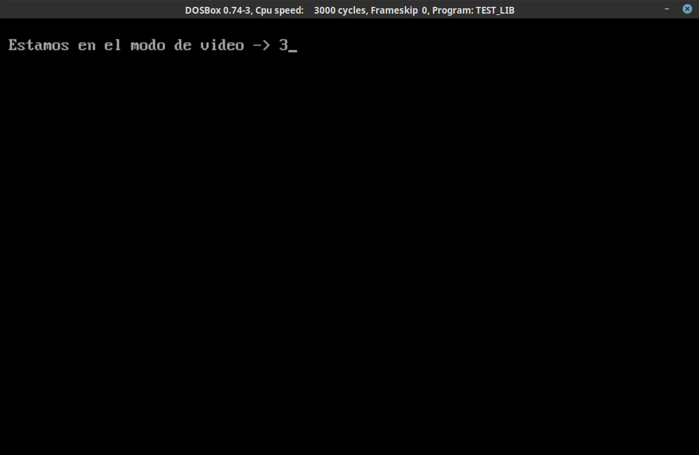

# Práctica 1. Entrada/Salida utilizando interrupciones con lenguaje C

- [Práctica 1. Entrada/Salida utilizando interrupciones con lenguaje C](#práctica-1-entradasalida-utilizando-interrupciones-con-lenguaje-c)
  - [1. Emulando la librería `<conio.h>`. Header `conint.h`](#1-emulando-la-librería-conioh-header-coninth)
    - [1.1 El cursor: `goToXY()` y `setCursorType()`](#11-el-cursor-gotoxy-y-setcursortype)
      - [[1] Posiciones según tipos](#1-posiciones-según-tipos)
    - [1.2 Modos de vídeo: `setVideoMode()` , `getVideoMode()` y `clearScreen()`](#12-modos-de-vídeo-setvideomode--getvideomode-y-clearscreen)
    - [1.3 Colores de fondo: `setTextBackground()` y `setTextColor()`](#13-colores-de-fondo-settextbackground-y-settextcolor)
    - [1.4 Representación en pantalla: `colorPutChar()`, `getchE()` y `getChar()`](#14-representación-en-pantalla-colorputchar-getche-y-getchar)
    - [1.5 Pruebas](#15-pruebas)
  - [2. Un paso más allá...](#2-un-paso-más-allá)
    - [2.1 Pintando rectángulos en ASCII](#21-pintando-rectángulos-en-ascii)
    - [2.2 Gráficos: El header `cgrafx.h`](#22-gráficos-el-header-cgrafxh)

## 1. Emulando la librería `<conio.h>`. Header `conint.h`
Para hacer la primera parte he hecho una archivo de cabecera con las funciones pedidas para poder implantarlo en otros códigos.
Este se compone de varias constantes para hacer más cómodo el desarrollo y las funciones que se detallan más adelante.

Aquí todas las constantes:
```c
//Alias para las interrupciones
#define DOSINT 0x21
#define MONITORINT 0x10
#define KEYBINT 0x16

//Alias para los modos de v�deo
BYTE MODO_TEXTO = 3;
BYTE MODO_GRAFICO = 4;

//Alias para los estilos de cursor
#define CURSOR_INVISIBLE 0
#define CURSOR_NORMAL 1
#define CURSOR_GRUESO 2

//Alias para los colores
//Colores de texto
#define BLACK_TEXT 0x00
#define BLUE_TEXT   0x01
#define GREEN_TEXT 0x02
#define CYAN_TEXT 0x03
#define RED_TEXT 0x04
#define MAGENTA_TEXT 0x05
#define BROWN_TEXT 0x06
#define LIGHTGRAY_TEXT 0x07
#define DARKGRAY_TEXT 0x08
#define LIGHTBLUE_TEXT 0x09
#define LIGHTGREEN_TEXT 0x0A
#define LIGHTCYAN_TEXT 0x0B
#define LIGHTRED_TEXT 0x0C
#define LIGHTMAGENTA_TEXT 0x0D
#define YELLOW_TEXT 0x0E
#define WHITE_TEXT 0x0F
#define BLINK_TEXT 0X80

//Colores de fondo
#define BLACK_BG 0x00
#define BLUE_BG 0x10
#define GREEN_BG 0x20
#define CYAN_BG 0x30
#define RED_BG 0x40
#define MAGENTA_BG 0x50
#define BROWN_BG 0x60
#define LIGHTGRAY_BG 0x70
```

Para hacer funcionar las cabeceras, en un inicio las incluí en la carpeta `BC/BIN`, pero el pasado jueves un compañero hizo un script para poder compilar sin usar el editor, al cual le incluí mi ruta `include` para hacerlo funcionar:

```
BCC -Ic:\BC\INCLUDE -Ic:\P1\INCLUDE -Lc:\BC\LIB	%1.C
```

### 1.1 El cursor: `goToXY()` y `setCursorType()`

Esta tabla resume dónde van los argumentos, según la función:
|Funcion| Cod. Interrupción | AH | AL | BH | BL | CH | CL | DH | DL |
|-|-|-|-|-|-|-|-|-|-|
|`goToXY(x,y)`|0x10|2||0||||PosX|PosY|
|`setCursorType(type)`|0x10|1||||000/010 [[1]](#1-posiciones-según-tipos)|000/010 [[1]](#1-posiciones-según-tipos)||

#### [1] Posiciones según tipos
- Para el modo invisible: CH = 010, CL= 000.
- Para el modo normal: CH = 010, CL= 010.
- Para el modo grueso: CH = 000, CL= 010.


```c
void goToXY(int x, int y){
		union REGS inregs, outregs;
		inregs.h.dl = x ;
		inregs.h.dh = y ;
		inregs.h.bh = 0 ;
		inregs.h.ah = 2 ;
		int86(MONITORINT, &inregs, &outregs);
}

void setCursorType(int type){
		union REGS inregs,outregs;
		inregs.h.ah = 0x01;
		switch(type){
			case CURSOR_INVISIBLE:
				inregs.h.ch = 010 ;
				inregs.h.cl = 000 ;
			break;
			case CURSOR_NORMAL:
				inregs.h.ch = 010 ;
				inregs.h.cl = 010 ;
			break;
			case CURSOR_GRUESO:
				inregs.h.ch = 000 ;
				inregs.h.cl = 010 ;
			break;
		}
		int86(MONITORINT,&inregs,&outregs);
}

```


### 1.2 Modos de vídeo: `setVideoMode()` , `getVideoMode()` y `clearScreen()`

|Funcion| Cod. Interrupción | AH | AL | 
|-|-|-|-|
|`setVideoMode(mode)` | 0x10 | 0x0 | Modo de vídeo|
|`getVideoMode()` | 0x10 | 0xF | (Output) Modo de vídeo

Sobre `clearScreen()`, solo cambia de modo dos veces, ya que al cambiar de modo se borra todo.

```c
void setVideoMode(int mode){
        union REGS inregs,outregs;
		inregs.h.ah = 0;
		inregs.h.al = mode;
		int86(MONITORINT, &inregs, &outregs);
}

int getVideoMode(){
		union REGS inregs,outregs;
		inregs.h.ah = 0xF;
		int86(MONITORINT, &inregs, &outregs);
		return outregs.h.al;
}

void clearScreen(){
    setVideoMode(MODO_GRAFICO);
    setVideoMode(MODO_TEXTO);
}
```


### 1.3 Colores de fondo: `setTextBackground()` y `setTextColor()`
A fin de almacenar los valores de fondo y texto, se crearon las variables `foreground` y `background` y para asociar fácilmente qué colores coger, se hicieron los `#define` correspondientes a cada color de fondo y texto, accesible cuando se incluye el header.

Nótese que no es lo mismo un color de fondo que un color de texto, ya que internamente se representan los colores de fondo en el primer cuarteto (0x00,0x10,0x20...) y los de texto en el segundo (0x00,0x01,0x02...)

A la hora de pintar, en el registro pertinente se suman ambos valores para dar con la combinación pedida.

```c
void setTextColor(int color){
    foreground = color;
}

void setTextBackground(int color){
    background = color;
}
```

### 1.4 Representación en pantalla: `colorPutChar()`, `getchE()` y `getChar()`

|Funcion| Cod. Interrupción | AH | AL | BH | BL | CX |
|-|-|-|-|-|-|-|
|`colorPutChar(c)`| 0x10 | 9  | Caracter a imprimir | 0| `background + foreground` [[2]](#13-colores-de-fondo-settextbackground-y-settextcolor) | 1
|`getChar()`| 0x16 | 0 | (Output) Tecla pulsada

`getchE()` hace uso de `getChar()` y `putChar(c)`, donde el primero recoge lo escrito en pantalla y el segundo lo escribe a la pantalla, recuperando en una variable la tecla pulsada.

```c
void putChar(char c){
	 union REGS inregs, outregs;

	 inregs.h.ah = 2;
	 inregs.h.dl = c;
	 int86(DOSINT, &inregs, &outregs);
}

void colorPutChar(char c){
    union REGS inregs, outregs;

	 inregs.h.ah = 9;
     inregs.h.al = c ;
	 inregs.h.bl = foreground+background;
	 inregs.h.bh = 0;
	 inregs.x.cx = 1;
	 int86(MONITORINT, &inregs, &outregs);
}


char getChar(){
     union REGS inregs, outregs;
	 int caracter;

	 inregs.h.ah = 0;
	 int86(KEYBINT, &inregs, &outregs);

	 caracter = outregs.h.al;
	 return caracter;
}

char getchE(){
	char c = getChar();
    putChar(c);
    return c;
}
```

### 1.5 Pruebas
Se hizo un archivo de pruebas donde se usaban todas las funciones.
Aquí algunas fases:

Nada más arrancar parece que no pasa nada


Pulsamos y se borra la pantalla:


Movemos el cursor:


Y cambiamos los modos:


Consultamos el modo de vídeo:



Probamos a escribir con fondo azul:


Y con fondo verde:


Y probamos a pulsar una tecla:


## 2. Un paso más allá...
### 2.1 Pintando rectángulos en ASCII

Usando lo hecho previamente, vamos a pintar rectángulos en ASCII.

Se pide:
  - Color de fondo
  - Color de texto
  - Punto X,Y de inicio
  - Punto X,Y de final (que sean mayores)

```c
void paintRectangle(int bg, int fg, int x0, int y0, int xf, int yf){
	int x,y;

	goToXY(x0,y0);
	setTextColor(fg);
	setTextBackground(bg);

	for (y = y0 ; y <= yf ; y++){
		for (x = x0 ; x <=  xf ; x++){
			goToXY(x,y);
			if (x == x0 || y == y0 || x == xf || y == yf ){
				colorPutChar('*');
			}
			else{
				colorPutChar(' ');
			}
		}
	}
}
```

Con ello hicimos unas pruebas:

Probamos a pintar un par de rectángulos sin borrar la pantalla:


Y luego emulamos una carta de ajuste:


### 2.2 Gráficos: El header `cgrafx.h`

A partir de cambiar los modos de vídeo, y usando el archivo del profesor donde definía cómo pintar un píxel, abstraje como pintar líneas:

```c
oid lineaHorizontal(int xInicio, int xFinal, int y, int color){
	int iter;
	for (iter=xInicio ; iter < xFinal ; iter++){
		pixel(iter,y,color);
	}
}

void lineaVertical(int yInicio, int yFinal, int x, int color){
	int iter;
	for (iter=yInicio ; iter < yFinal ; iter++){
		pixel(x,iter,color);
	}
}

void lineaDiagonalIzquierda(int xInicio, int yInicio, int xFinal, int color){
    int x ;
    int y ;
    y = yInicio;
    for (x = xInicio ; x >= xFinal ; x-- ){
        pixel(x,y,color);
        y--;
    }
}

void lineaDiagonalDerecha(int xInicio, int yInicio, int xFinal, int color){
    int x ;
    int y ;
    y = yInicio;
    for (x = xInicio ; x <= xFinal ; x++ ){
        pixel(x,y,color);
        y--;
    }
}
```

Y un par de formas:
```c
void pintarRectangulo(int xInicio, int xFinal, int yInicio, int yFinal, int color){
    lineaHorizontal(xInicio,xFinal,yInicio,color);
    lineaVertical(yInicio,yFinal,xInicio,color);
    lineaHorizontal(xInicio,xFinal,yFinal,color);
    lineaVertical(yInicio,yFinal,xFinal,color);
}

void pintarTriangulo(int xyPunta, int altura, int base,int color){
    int xBase0, xBaseF, yBase ;
    xBase0 = xyPunta - (base/2);
    xBaseF = xyPunta + (base/2);
    yBase = xyPunta + altura;
    lineaHorizontal(xBase0,xBaseF,yBase,color);
    lineaDiagonalDerecha(xBase0,yBase,xyPunta,color);
    lineaDiagonalIzquierda(xBaseF,yBase,xyPunta,color);
```

Con ello hice otro archivo de cabecera que me permitiera "programar dibujos", el cual usando el script anterior me permite "compilarlos".

Para probar intentamos hacer un pequeño dibujo que acabó así:

