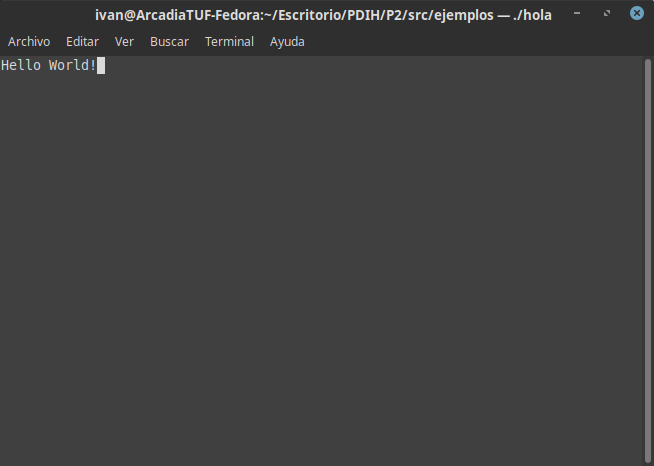

# Práctica 2. Uso de ncurses para crear interfaces de usuario en modo texto bajo Linux

- [Práctica 2. Uso de ncurses para crear interfaces de usuario en modo texto bajo Linux](#práctica-2-uso-de-ncurses-para-crear-interfaces-de-usuario-en-modo-texto-bajo-linux)
  - [0. ¿Qué es `ncurses` y cómo lo instalo?](#0-qué-es-ncurses-y-cómo-lo-instalo)
  - [1. Probando algunos ejemplos para entender cómo funciona.](#1-probando-algunos-ejemplos-para-entender-cómo-funciona)
    - [1.1 "Hola mundo"](#11-hola-mundo)
    - [1.2 Ventanas y subventanas](#12-ventanas-y-subventanas)
    - [1.3 Moviendo una pelotita por la pantalla](#13-moviendo-una-pelotita-por-la-pantalla)
  - [2. Ping, PONG: Recreando un juego con `ncurses`](#2-ping-pong-recreando-un-juego-con-ncurses)
  - [3. En conclusión...](#3-en-conclusión)

## 0. ¿Qué es `ncurses` y cómo lo instalo?
La librería `ncurses` es  una  biblioteca  de  programación  que  provee  una  API  que  permite  al programador escribir interfaces basadas en texto, similares a los que se veían en apliaciones DOS (véase [la práctica anterior](../S2/README.md) para tener una ligera idea del resultado).

Para instalarlo, en mi caso, en Fedora (podría ser aplicable a los demás SO de RedHat), se instala con :

```bash
sudo dnf install ncurses-devel
```

## 1. Probando algunos ejemplos para entender cómo funciona.
### 1.1 "Hola mundo"
Crea una ventana que dice "Hello World!".

```c
#include <ncurses.h>
#include <stdio.h>
int main()
{
initscr();
printw("Hello World!");
refresh();
getch();
endwin();
return 0;
}

```

Aquí podemos apreciar las primeras funciones, básicas para poder lanzar una ventana. Estas serían:

|Función|¿Qué hace?|¿Devuelve algo?|
|-|-|-|
|`initscr()`| Inicializa la terminal en modo curses | No |
|`printw(<Texto>)`| Imprime `<Texto>` para mostrarse | No |
|`refresh()`| Muestra todo en pantalla | No |
|`getch()`| Esperar la pulsación de una tecla | Si |
|`endwin()`| Terminar el modo curses | No |

Para compilar cualquier programa que usa ncurses en C, como por ejemplo este, tendríamos que llamar a gcc así :

```bash
gcc -o hola hello.c -lncurses
```

Si todo compila bien, al ejecutar obtendríamos:


### 1.2 Ventanas y subventanas

Crea una caja con una ventana donde se escribe algo.

```c
#include <stdlib.h>
#include <ncurses.h>

int main(void) {
    int rows, cols;

    initscr();

    if (has_colors() == FALSE) {
    	endwin();
    	printf("Your terminal does not support color\n");
    	exit(1);
	}

    start_color();
    init_pair(1, COLOR_YELLOW, COLOR_GREEN);
    init_pair(2, COLOR_BLACK, COLOR_WHITE);
    init_pair(3,COLOR_WHITE,COLOR_BLUE);
    clear();

    refresh();
    getmaxyx(stdscr, rows, cols); 

    WINDOW *window = newwin(rows,cols,0,0);
    wbkgd(window, COLOR_PAIR(3));
    box(window, '|', '-'); 

    mvwprintw(window, 10, 10, "una cadena");
    wrefresh(window);

    getch(); 
    endwin();
    return 0;
}

```
Para manejar ventanas, usaríamos las siguientes funciones adicionales

|Función|¿Qué hace?|¿Devuelve algo?|
|-|-|-|
|`has_colors()`| Pregunta si soporta gráficos a color | Sí, un Boolean |
|`start_color()`| Permite definir colores en las ventanas | No |
|`init_pair(<index>, <foreground>, <background>)`| Asigna una combinación de color de fondo y de texto a un índice | No |
|`newwin(<filas>,<cols>,<Xinicio>, <Xfin>)`| Crea una ventana | Si, un `WINDOW *` |
|`mvwprintw(<Ventana>, <X>,<Y>,<Texto>)`| Análogo a `printf`. Imprime un texto en la ventana en la posición (X,Y) | No |
|`wbkgd(<Ventana>, <Paleta>)`| Asigna una paleta a una ventana | No |
|`box(<Ventana>, <Car.horizontal>,<Car.Vertical>)`| Crea una cja rodeada de caracteres por los límites de la ventana | No |
|`wrefresh()`| Refresca la pantalla | No |

Con una ventana:


Si creamos otra ventana se vería así:


Para ello hemos añadido el siguiente código:
```c
    WINDOW *window2 = newwin(rows/2,cols/2,0,cols/2);
    wbkgd(window2, COLOR_PAIR(1));
    box(window2, '*', '_'); 

    mvwprintw(window2, 10, 10, "otra cadena");
    wrefresh(window);
    wrefresh(window2);
```


### 1.3 Moviendo una pelotita por la pantalla

Este programa mueve un caracter `o` , a modo de pelota, entre 0 y `max_x`

```c
#include <ncurses.h>
#include <unistd.h>

#define DELAY 30000

int main(int argc, char *argv[]) {
 int x = 0, y = 0;
 int max_y = 20, max_x = 20;
 int next_x = 0;
 int direction = 1;

 initscr();
 noecho();
 curs_set(FALSE);

 while(1) {
 	clear();
 	mvprintw(y, x, "o");
 	refresh();

 	usleep(DELAY);

 	next_x = x + direction;

 	if (next_x >= max_x || next_x < 0) {
 		direction*= -1;
 	} else {
 		x+= direction;
 	}
 }

 endwin();
}
```
Se hace uso de la biblioteca `unistd`, de la cual usamos esta función:

|Función|¿Qué hace?|¿Devuelve algo?|
|-|-|-|
|`usleep(<Delay>)`| ESpera un tiempo | No |
|`curs_set(0/1/2)`|Cambia el modo del cursor| Si, el estado anterior|
|`mvprintw(<y>,<x>,<Texto>)`|Véase `mvwprintw()`|-|

Si queremos que rebote:

```c
#include <ncurses.h>
#include <unistd.h>

#define DELAY 50000

int main(int argc, char *argv[]) {
 int x = 5, y = 0;
 int max_y = 25, max_x = 80;
 int next_x = 0;
 int directionx = 1;
 int next_y = 0;
 int directiony = 1;

 initscr();
 noecho();
 curs_set(FALSE);

 while(1) {
 	clear();
 	mvprintw(y, x, "o");
 	refresh();

 	usleep(DELAY);

 	next_x = x + directionx;
 	next_y = y + directiony;

 	if (next_x >= max_x || next_x < 0) {
 		directionx*= -1;
 	} else {
 		x+= directionx;
 	}

 	if (next_y >= max_y || next_y < 0) {
 		directiony*= -1;
 	} else {
 		y+= directiony;
 	}
 }

 endwin();
}
```

Así, al compilar y ejecutar, obtenemos...


## 2. Ping, PONG: Recreando un juego con `ncurses`
Para recrear el juego necesitamos un marcador, una zona de juego, una pelota, unas paletas y las instrucciones.

Para las instrucciones, sólo habría que crear una ventana con todo los controles.

```c
    init_pair(1, COLOR_GREEN, COLOR_BLACK);

    WINDOW *window3 = newwin(rows,cols/2,0,cols/4);
    wbkgd(window3, COLOR_PAIR(1));
    box(window3, '|', '-');

    mvwprintw(window3, 1, 1, "Bienvenidos a PONG");
    mvwprintw(window3, 5, 1, "Estos son los controles:");
    mvwprintw(window3, 7, 1, "W/S : Mover la paleta del P1");
    mvwprintw(window3, 9, 1, "UP/DOWN : Mover la paleta del P2");
    mvwprintw(window3, rows-5, 1, "<Pulse una tecla para empezar>");

    wrefresh(window3);

    getch(); 
```

Da como resultado:


Seguidamente, la zona de juego, la cual es dos ventanas. Una (en azul) da el contador de puntos y otra (en blanco) es la zona de juego en sí.

El contador se pondría en la zona azul, en medio.

```c
    init_pair(3,COLOR_WHITE,COLOR_BLUE);

    WINDOW *window = newwin(rows,cols,0,0);
    wbkgd(window, COLOR_PAIR(3));
    box(window, '|', '-'); 

    mvwprintw(window, 2,(cols/2)-3, "0");
    mvwprintw(window, 2,(cols/2), "|");
    mvwprintw(window, 2,(cols/2)+3, "0");

    wrefresh(window);

    
```

Para actualizar los contadores:
```c
  if (next_x >= max_x || next_x < 0) {
            
    (directionx == 1)? points_p1++ : points_p2++;
    wclear(window);
    box(window, '|', '-'); 
    mvwprintw(window, 2,(cols/2)-3, "%d", points_p1);
    mvwprintw(window, 2,(cols/2), "|");
    mvwprintw(window, 2,(cols/2)+3, "%d", points_p2);
    wrefresh(window);
    directionx*= -1;
    x = cols/2;
  }
```

En la zona de juego tendríamos la pelota (que se basa en el `rebota.c` pero adaptado para estar limitado en la ventana) y dos paletas representados por la letra `N`.

```c
  pos_p1 = pos_p2 = (rows-4)/2;

  mvwprintw(window2, y, x, "o");
  mvwprintw(window2, pos_p1,1,"N" );
  mvwprintw(window2, pos_p1 + 1,1, "N" );
  mvwprintw(window2, pos_p1 + 2,1, "N" );

  mvwprintw(window2, pos_p2,cols-2, "N" );
  mvwprintw(window2, pos_p2 + 1,cols-2, "N" );
  mvwprintw(window2, pos_p2 + 2,cols-2, "N" );

  wrefresh(window2);

  usleep(DELAY);
```

Se nos quedaría:


Para hacer mover las paletas, usaremos las teclas `W`, `S`, `UP` y `DOWN`. Para evitar parones por el `getch()`, deberemos poner `nodelay()`. Así, todo parece más dinámico.

```c
  nodelay(stdscr,TRUE);

  switch(getch()){
      case 'w':
      case 'W':
        if(pos_p1 > 1) pos_p1--;
      break;
      case 's':
      case 'S':
        if(pos_p1 < rows - 8) pos_p1++;
      break;
      case KEY_UP:
        if(pos_p2 > 1) pos_p2--;
      break;
      case KEY_DOWN:
        if(pos_p2 < rows - 8)pos_p2++;
      break;
  }
```

Quedándose finalmente:


Para reescalar, intentamos comparar los maximos X e Y con las columnas y filas y de ser así lo reescale:

```c
  getmaxyx(stdscr, max_y, max_x);

  if (cols != max_x || rows != max_y){
    old_x = x;
    old_y = y;
    x = old_x * (float)((max_x/cols)*1.0) ;
    y = old_y * (float)((max_y/rows)*1.0);

    getmaxyx(stdscr, rows, cols);
    wresize(window, rows, cols);
    wresize(window2, rows-4, cols);


      wclear(window);
      box(window, '|', '-'); 
      mvwprintw(window, 2,(cols/2)-3, "%d", points_p1);
      mvwprintw(window, 2,(cols/2), "|");
      mvwprintw(window, 2,(cols/2)+3, "%d", points_p2);

    box(window2, '|', '-');
    box(window, '|', '-');

    wrefresh(window);
    wrefresh(window2);
  }
```

Pero hay ciertos problemillas, ya que al aumentar la resolución va todo bien, pero al reducirlo se mueve al campo contrario. Actualizaré si logro hacerlo...

>**Actualizo a 8 de Abril**: Finalmente lo logré arreglar, pero el reescalado permite cambiar sólo la ventana de juego hasta que se marque un tanto, cuando se haga la actualización. En el inicio del programa, sin embargo, no se ha tenido en cuenta, y al aumentar el tamaño inicia el juego de igual forma.

> El código varía ligeramente, siendo el cambio:
> ```c
>   x = old_x * (float)((max_x*1.0/cols)) ;
>   y = old_y * (float)((max_y*1.0/rows));
> ```
> Eso sí, en consecuencia, podrían ocurrir cosas inesperadas como que se haya borrado el terreno de juego a resoluciones sin sentido. Pero creo que sería ya un caso muy extremo, y como se comentó en la sesión de esta nota, no iba a ser muy trascendental tratar este detalle, por lo que lo dejaré así.


## 3. En conclusión...
La biblioteca `ncurses` podría ser muy útil para sistemas que se busque una interfaz similar a la de ventana pero dentro de una interfaz de texto, como por ejemplo las Raspberry Pi más modestas (véase, por ejemplo, la RPi Zero W), que podrían usarse para mostrar pequeñas informaciones de dispositivos IoT en una pantalla sin necesidad de usar un entorno de escritorio.

El hecho también de poder usarse en otros lenguajes como Python pueden hacer de esta biblioteca muy útil para ese tipo de casuísticas.

En definitiva, el uso de este lenguaje permite una representación más cómoda e incluso visual de la información, a medio camino entre la interfaz pura de texto y los actuales gestores de escritorios.


