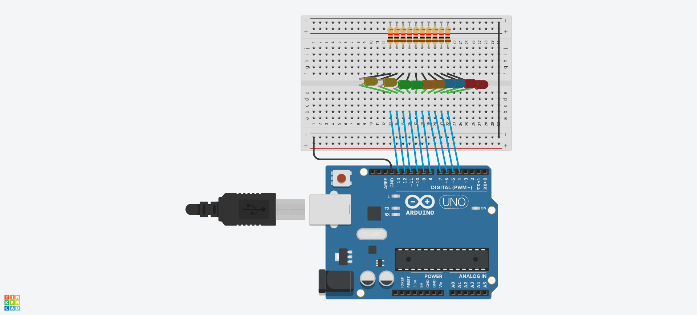
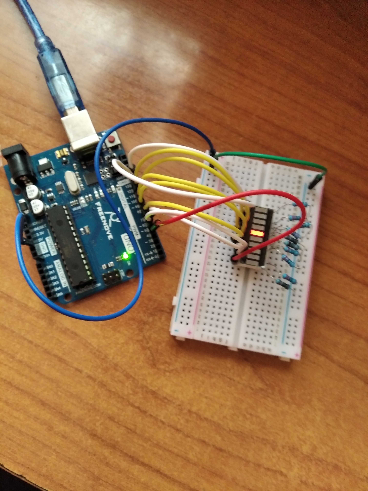
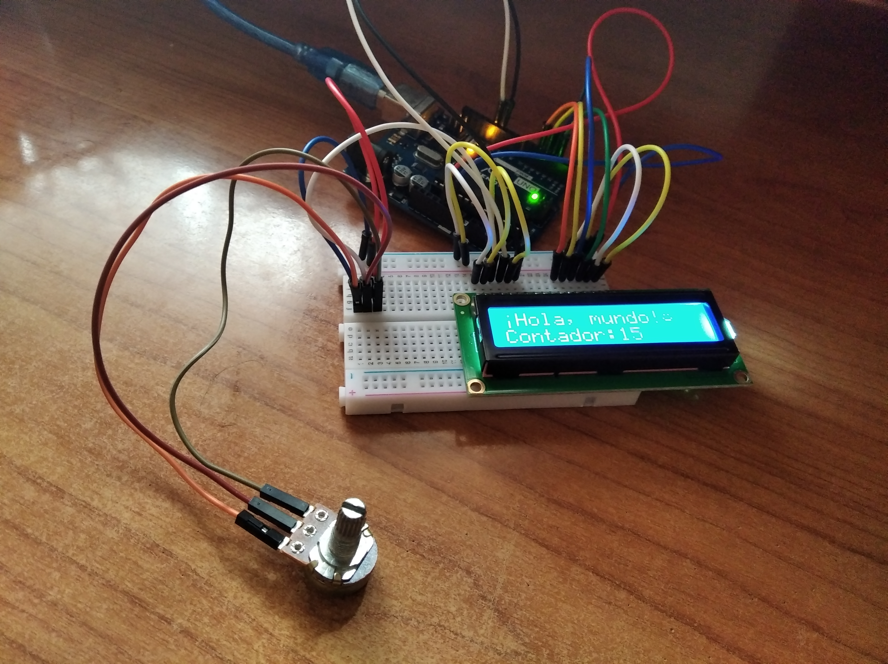
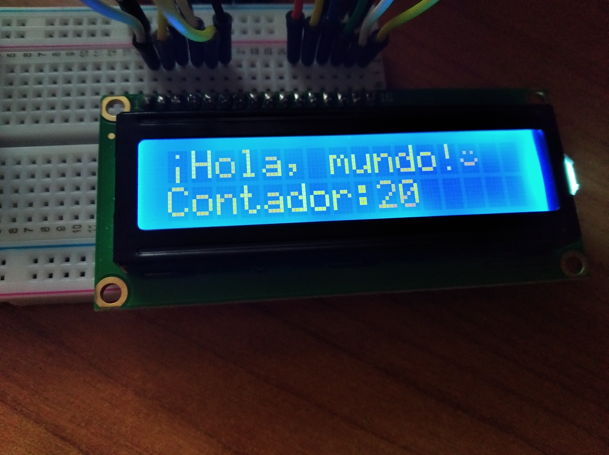

# Práctica 3. Experimentando con Arduino

> Esta práctica es una continuación del Seminario 3, donde hacemos otro par de ejemplos. Puede consultarse [aquí](../S-arduino/README.md)

## 1. Un montón de LEDs, el LED Bar Graph y el Coche Fantástico
Para este montaje habría que conectar 10 LEDs a los pines 4 al 13. Para proteger los diodos, se ponen resistencias de 220 Ohmios. Así quedaría el esquema en Tinkercad:

En el montaje real se hizo uso, en vez de usar 10 LEDs, de un LED Bar Graph, que incluye 10 LEDs rojos. Usando la misma esquemática, y con el código adjunto, se podría ver algo como el siguiente::

## 2. La pantalla LCD 16x2 y caracteres especiales
En un principio la idea era sonar un pitido por el sensor de cercanía. Pero al no tenerlo en mi kit de Arduino (yo tengo el Freenove UNO Super Pack), pero tener una pantalla LCD 16x2, decidí hacer el montaje basándome en el Capítulo 13.A de la guía, cambiando algunas cosas.

Este sería el montaje en Tinkercad:

Conste que si se ejecutara en simulación no funcionaría, pero si lo hiciéramos en un entorno físico, saldría lo que se ve justo en las últimas imágenes.

Además de ello, quise añadir caracteres especiales, ya que cada celda es una pequeña matriz 5x8. Así, usando un generador [como este](https://maxpromer.github.io/LCD-Character-Creator/), se convierte la representación en binario o hexadecimal, y además se dan instrucciones para añadir ese custom char en el LCD.
Se crearon dos custom chars, un smiley y el signo de apertura de exclamación, ya que en el texto del LCD no lo admitía.

El resultado en físico resultaría:

