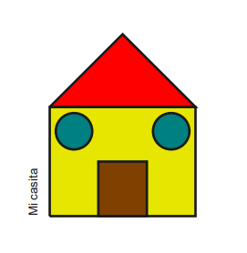
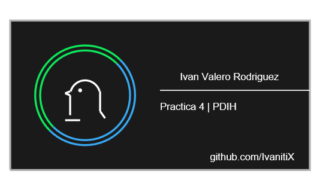

# Práctica 4. El lenguaje Postscript

## 1. Haciendo un script para dibujar una casita
La casita se compone de:
- Un rectángulo para la fachada, de color amarillo
- Un tejado representado por un triángulo
- Una puerta representada por otro rectángulo
- Dos círculos representando las ventanas
- Y el texto vertical de *Mi casita*
  
Para poder hacer el trazado y el relleno, hubo que duplicar las formas y en cada una de las formas aplicar `stroke` para no mezclar los colores.

El resultado fue el siguiente:

## 2. Un script para la tarjeta de visita
Para la tarjeta de visita, se han hecho varias zonas para cada cosa.
En la mitad de la derecha se ponen los textos. Nótese que no existe la negrita, cursiva o subrayado. Para hacer más o menos el subrayado, usé una línea de 2 de anchura, intentando centrar un poco el texto.

En la parte izquierda quise hacer algún pequeño dibujo complejo, en el cual un círculo bicolor, compuesto de 4 arcos, 2 grandes y dos pequeños, cada uno de ellos de un color. Por la otra parte, se intentó hacer una versión simplificada de un pingüino (si bien parece un pájaro a medio terminar), compuesto de un arco de 160º, un círculo pequeño, dos líneas verticales, tres diagonales (dos corresponden al pico y una a la cola), y una línea horizontal representando las patas.
Todo ha sido pintado por las líneas, sin relleno. 

>Nótese que en la tarjeta no hay acentos. De haberlos, se ponen dos símbolos extraños. Podría ser por la codificación de testo de PostScript.

El resultado fue el siguiente:

