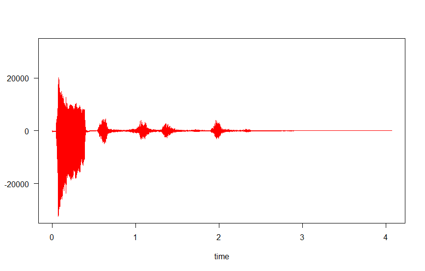
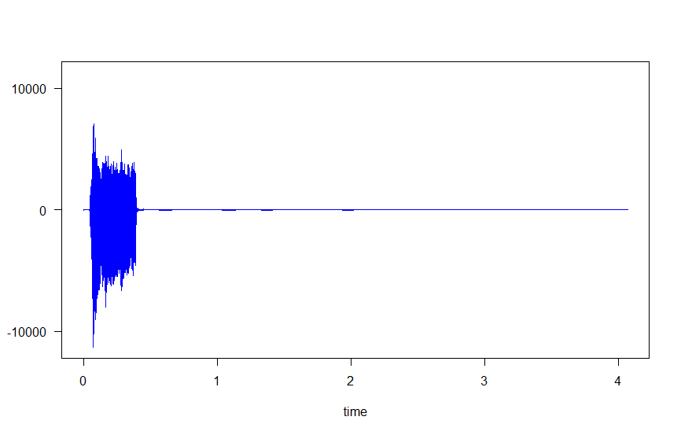
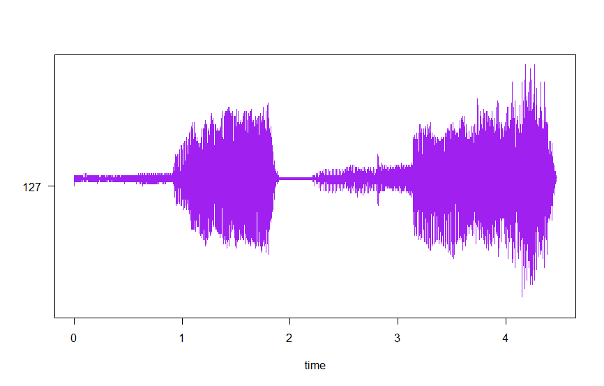
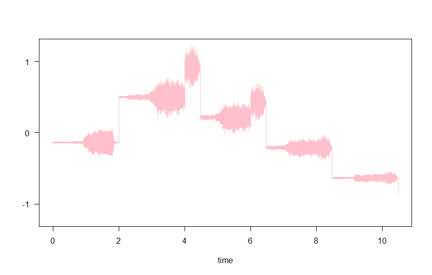
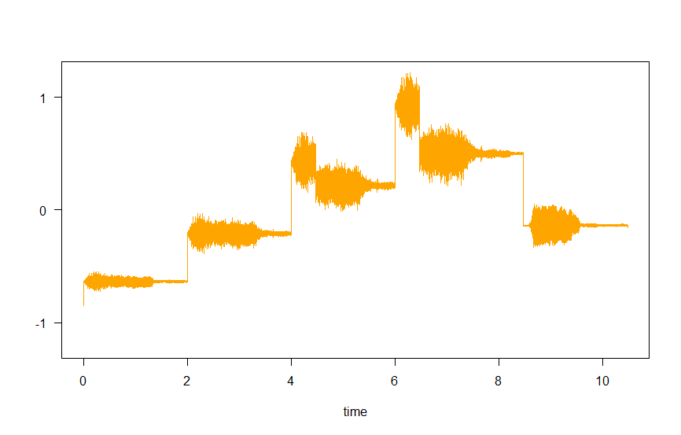

# Práctica 5. Experimentación  con  el  sistema  de salida de sonido.

> Es la continuación del [Seminario 5](../S-sonido/README.md), dondehemos experimentado un poco con R y los archivos WAV.

Para esta práctica se ha realizado un script en dos partes. La primera es como la hecha en el seminario, pero donde además se realiza un filtrado; y la segunda parte es tratar otro archivo de audio para darle eco e invertirlo.

## 1. Cargando los archivos
Es similar (si no idéntico) a lo visto en el Seminario. Cambia la ruta del trabajo a la carpeta de audios de la Práctica. Eso sí, habría que cambiar la ruta a la de quien vaya a usar el script, pues parece que el enrutamiento relativo no funciona muy bien (o no sé cómo es en R).

```r
#Carga de librerías
library(tuneR)
library(seewave)
library(audio)

#Path de trabajo
setwd("C:/Users/Ivan/Desktop/Clase/PDIH/P5/aud")

#Carga de archivos
perro <- readWave("perro.wav")
oveja <- readWave("oveja.wav")

#Comprobamos que estén cargados
perro
oveja
```

## 2. Combinación y filtrado
En esta ocasión filtramos las frecuencias entre 10000 y 20000Hz. Para ello se hace uso de `bwfilter`, si bien parece que achata las ondas hastsa llegar al máximo, dando por consecuencia que el audio suene con menor volumen.

Se hanrealizado las gráficas del antes (rojo) y el después (azul), donde podemos ver que las ondas del sonido del perro después del filtrado se vuelve más pequeño .

```r
#Unir sonidos
union <- pastew(perro,oveja,output="Wave")
f <- perro@samp.rate

#Dibujamos la onda unida
plot(extractWave(union,from = 1, to = length(union@left)),col = "red")
```


```r
#Pasamos el filtro de frecuencia
filtrado <- bwfilter(union, f=f, channel=1, n=1, from=10000, to=20000, bandpass=TRUE, listen=FALSE, output = "Wave")

#Dibujamos la onda filtrada
plot(extractWave(filtrado,from = 1, to = length(filtrado@left)),col = "blue" )
```


Acabamos guardando el archivo:
```r
#Guardamos el resultado
savewav(filtrado,f=filtrado@samp.rate,filename = "mezcla.wav")
```

## 3. Aplicando efectos
Tras hacer el guardado, vamos a abrir otro archivo (el sonido de la vaca), y le hacemos la gráfica para comparar luego.

```r
#Se lee un nuevo archivo
vaca <- readWave("vaca.wav")
vaca
plot(extractWave(vaca,from = 1, to = length(vaca@left)),col = "purple")
```




Para darle eco, se usa la función `echo`, donde se pasan dos vectores. Uno contiene la frecuencia relativa, y otro con el delay que quedaba para el eco.
Al extraer la gráfica, podemos ver que la segunda zona del original sube de frecuencia junto con un poco de la primera, tras lo cual repite la forma dos veces más, a menores frecuencias.
```r
#Ponemos eco
vacaEco <- echo(vaca,f=vaca@samp.rate,amp = c(0.9,0.6,0.3), delay = c(2,4,6), output = "Wave")
str(vacaEco)
plot(extractWave(vacaEco,from = 1, to = length(vacaEco@left)),col = "pink")
```


Para ponerlo al revés, se usa `revw`, que no tiene argumentos. AL ver la gráfica, se puede ver que la forma es totalmente inversa por el eje vertical.

```r
#Y lo ponemos al revés
vacaEcoReverse <- revw(vacaEco, output = "Wave")
str(vacaEcoReverse)
plot(extractWave(vacaEcoReverse,from = 1, to = length(vacaEcoReverse@left)),col = "orange")
```


Para guardar el archivo:
```r
#Guardamos el resultado
savewav(vacaEcoReverse,f=vacaEcoReverse@samp.rate,filename = "alReves.wav")
```