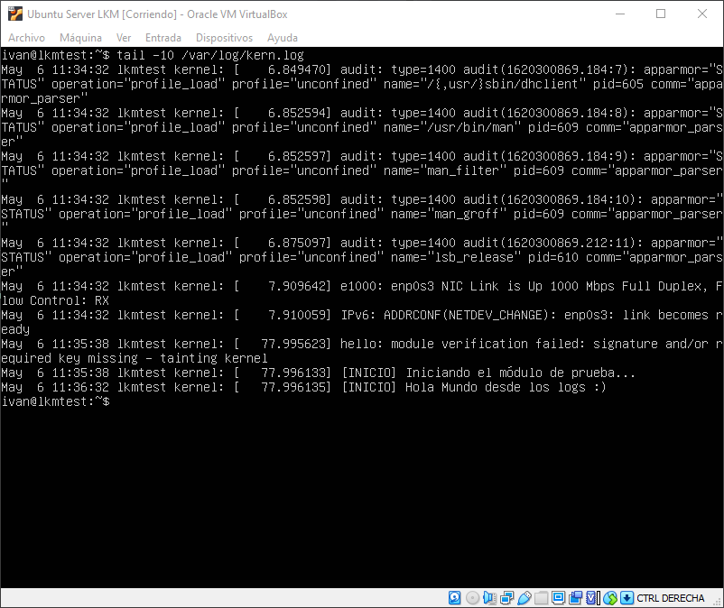

# Seminario 4. Módulos cargables del kernel.

Para realizar el módulo, he decidido basarme en el del ejemplo pero traducido y con alguna diferencia.

## La información del kernel
La información del kernel se definió con los headers `MODULE_X`. Así, la licencia sería normalmente de las usadas en Software Libre, generalmente GPL o AGPL.

En el nombre, he puesto el mío; y en la descripción puse algún placeholder. La versión, como no es ni oficial, la he puesto muy baja.
```c
MODULE_LICENSE("GPL");
MODULE_AUTHOR("Ivan Valero");
MODULE_DESCRIPTION("Un LKM para PDIH");
MODULE_VERSION("0.0.1");
```

## La función de carga del módulo
Simplemente muestra el mensaje en dos tipos: 

`KERN_INFO` : Mensaje de información, como la información de inicialización. Normalmente se queda en el log.

`KERN_ALERT` : Algo malo ocurre y debería tomarse alguna acción. En este tipo de alertas, se muestra en consola.

```c
static int __init saludar(void){
    printk(KERN_INFO "[INICIO] Iniciando el módulo de prueba");
    printk(KERN_ALERT "[INICIO] Hola %s desde los logs :)", nombre);
    return 0;
}

module_init(saludar);
```

## La función de descarga del módulo
Pone una alerta para despedirse.

```c
static void __exit despedirse(void){
    printk(KERN_ALERT "[INICIO] Adiós %s desde los logs :(", nombre);
}

module_exit(despedirse);
```

## Ejecutando el módulo del kernel
Para probar el módulo, se compiló usando el Makefile y se ejecutó, se miró la info y se desinstaló. Luego se muestran los logs.
Nótese que al pasarlo por primera vez no se ve el texto de desinstalación del módulo. Pero al hacerlo por segunda vez o reiniciar, se puede mostrar.



