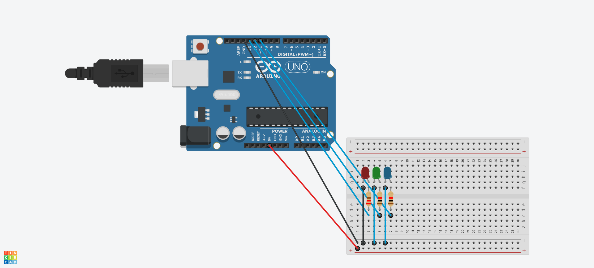
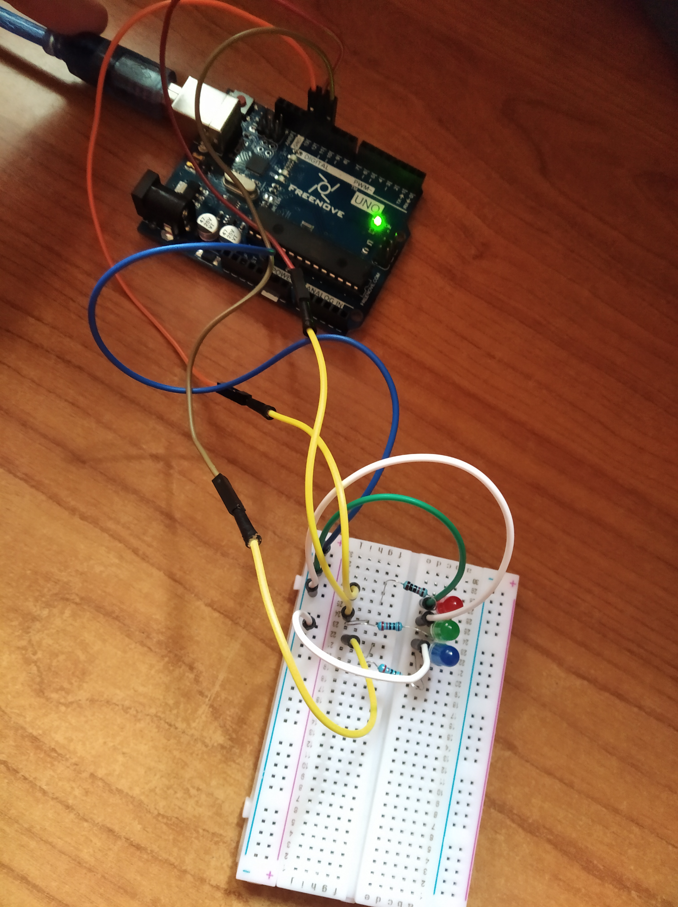
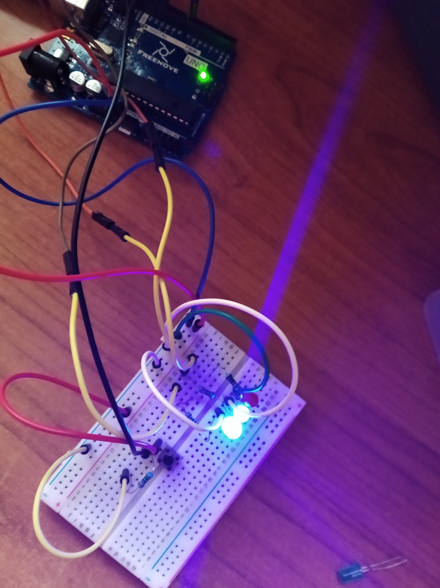
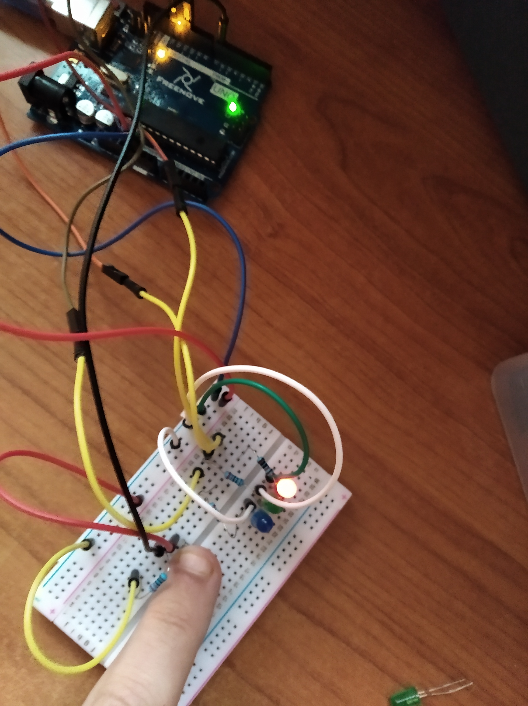

# Seminario 3. Introducción al uso de Arduino

## 1. Blink pero con varios LEDs a la vez
El primer programa solicitado era adaptar el programa Blink de los ejemplos de Arduino para poder hacer un blink de 3 LEDs en este caso, de forma de que se enciendan y apaguen los 3 a la vez.

Así pues, lo que habría que hacer es conectar dos LED más (le puse colores verde y azul para distinguirlos) conectados de forma idéntica al primero. El esquema en Tinkercad resulta ser:

Como tenia una placa Arduino Uno física, traté de recrearlo en físico teniendo de base la esquemática del TinkerCad. EL resultado fue el siguiente (la primera foto es cuando están apagados, la segunda cuando están todos encendidos):

## 2. Un botón para cambiar las reglas
A partir del programa anterior, se pedía añadir un botón el cual, si se pulsa, hace que deje de hacer la intermitencia de los LEDs azul y verde en favor de la intermitencia del LED rojo.

Para ello, había que implementar la entrada de un botón en el pin 7 en modo INPUT. Aquí se puede ver cómo sería el circuito en Tinkercad.

El resultado sería este:

Si pulsamos...

> Se continuará con otro par de proyectos en la [Práctica 3](../P3/README.md)