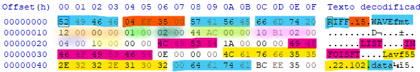
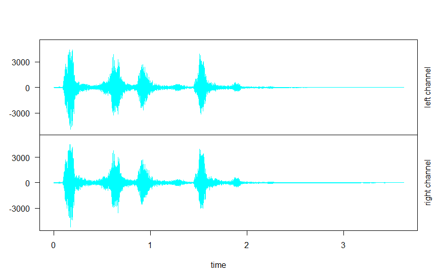
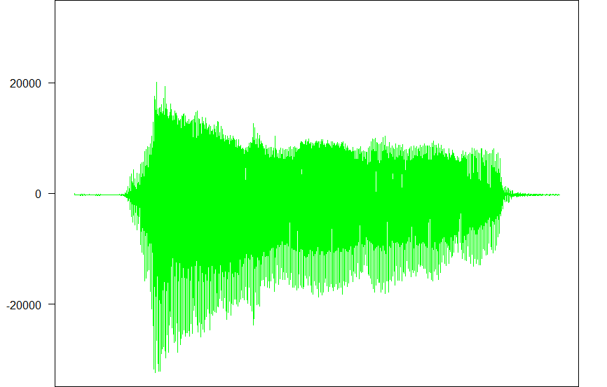

# Seminario 5. Manejo del sonido con R

## 1. Interpretando un archivo `.wav`

Al abrir en HxD el archivo desagradable.wav podemos ver  una serie de textos y puntos. Si vamos mirando, podemos convertirlos en enteros que descibirán cómo es el archivo en la cabecera



Tamaño de chunk (rojo) = 61188

Tamaño de chunk de datos (naranja) = 18

Formato audio (verde claro) = 1 - PCM

Canales (verde oscuro) = 2

Sample Rate (verde lima)  = 44100

Byte Rate (rosa) = 176400

Alineamiento de bloque (morado) = 4

Bits por muestra (amarillo) = 16

Hay también un bloque `LIST`, un bloque `INFO` y un bloque `ISFT`, señalados en magenta. Según [Stack Overflow](https://stackoverflow.com/a/63929383):
> Los chunks `LIST` de tipo `INFO` son comunes en formatos que extienden RIFF. Puede contener información de copyright, autores
> 
> <...>
> 
> `ISFT` Nombre del software usado para crear el archivo

En este caso, `ISFT` menciona el Codificador `Lavf55.22.102` (subrayado en amarillo), que forma parte de `FFmpeg`

## 2. Cargando y uniendo archivos con R y RStudio.
Para cargar los archivos, los asignaremos a variables. Aunque para ello nos harán falta varias librerías (se pueden descargar en RStudio):
```r
#Carga de librerías
library(tuneR)
library(seewave)
library(audio)

#Path de trabajo
setwd("C:/Users/Ivan/Desktop/Clase/PDIH/S-sonido/aud")

#Carga de archivos
oveja <- readWave("oveja.wav")
perro <- readWave("perro.wav")

#Comprobamos que estén cargados
oveja
perro
```


A la hora de hacer las gráficas, usaremos `plot()` en conjunto con `extractWave()` para sacar la onda.

```r
# Dibujamos su onda
plot(extractWave(oveja,from = 1, to = length(oveja@left)),col = "green" )
plot(extractWave(perro,from = 1, to = length(perro@left)),col = "cyan")
```

Como salida, obtenemos estas gráficas. La del perro es azul cian y la de la oveja, verde claro.




Podemos ver así como la Oveja tiene un canal con una frecuencia de hasta 20000 Hz; mientras que el perro tiene 2 canales con una frecuecnia máxima de 3000 Hz.

Para la unión, dentro de `seeWave` está la instrucción `pastew`, que concatena dos sonidos.

Al oírlos, se puede usar uno de los sample rates de los audios originales. Si pusiéramos el del perro, la oveja se escuchará muy rápida. Si ponemos la de la oveja, la del perro se escuchará muy lento.

```r
#Unir sonidos
union <- pastew(oveja,perro)

#Oír la unión (Frecuencia del sonido del perro)
f <- perro@samp.rate
listen(union, f=f)


#Oír la unión (Frecuencia del sonido de la oveja)
f <- oveja@samp.rate
listen(union, f=f)
```

## 3. Guardando el archivo
Si bien en el guión se recomendaba usar `writeWave`, he optado por usar saveWave de la librería `seeWave`.

```r
#Guardar la unión
savewav(union, f=f, filename = file.path("mezcla.wav"))
```

> Se continuará el proceso en la [Práctica 5](../P5/README.md), donde usaremos algunas herramientas más.
