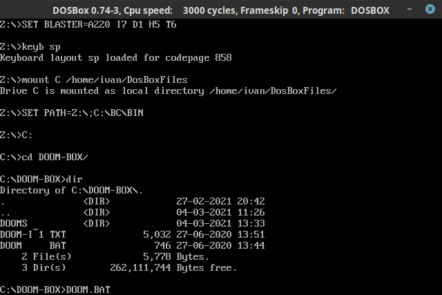
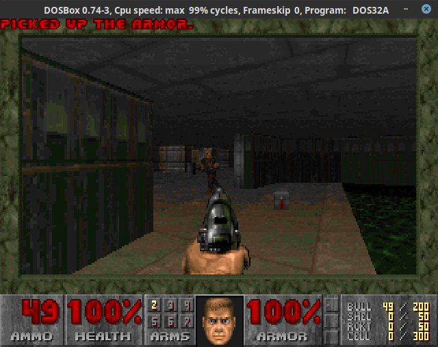
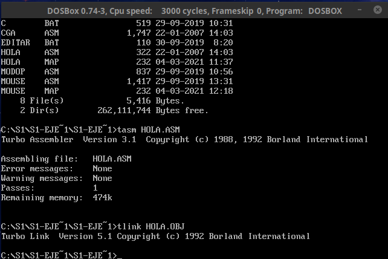
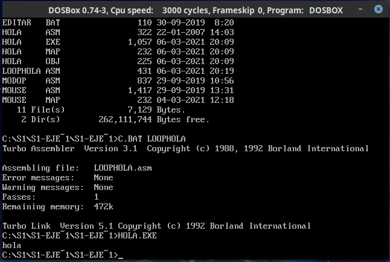

# Seminario 1 : Programación de dispositivos a bajo nivel

## Índice de contenidos
- [Seminario 1 : Programación de dispositivos a bajo nivel](#seminario-1--programación-de-dispositivos-a-bajo-nivel)
  - [Índice de contenidos](#índice-de-contenidos)
  - [1.1 Instalando y configurando DOSBox](#11-instalando-y-configurando-dosbox)
  - [1.2 Preparando el compilador.](#12-preparando-el-compilador)
  - [1.3 Hora de programar](#13-hora-de-programar)
    - [1.3.1 Probando ejemplos](#131-probando-ejemplos)
      - [El "Hola mundo"](#el-hola-mundo)
      - [Mostrando gráficos en CGA](#mostrando-gráficos-en-cga)
    - [1.3.2 Editando cosas de los programas](#132-editando-cosas-de-los-programas)
      - [Hola mundo, pero lo repite 7 veces](#hola-mundo-pero-lo-repite-7-veces)
      - [Intentemos escribir algo en CGA](#intentemos-escribir-algo-en-cga)

## 1.1 Instalando y configurando DOSBox
A la hora de instalar DOSBox se daba la opción de descargarlo a través de la página, pero en su lugar me decanté, ya que uso una distribución basada en Linux (Fedora en mi caso), a probar si ya estaba en los repositorios de paquetes de DNF.

Así pues, para instalarlo, hay que abrir una terminal y escribir:

```bash
sudo dnf install dosbox
```

Y tras ello nos toca configurar todo para poder iniciar correctamente el emulador.

Antes de nada convendría hacer una carpeta con todo lo que se quiera usar en el emulador, creando una carpeta (por ejemplo, DosBoxFiles).

Para ello, en el archivo `~/.dosbox/dosbox-0.74-3.conf` escribimos al final las siguientes líneas, donde la zona de `[autoexec]`:

```
[autoexec]
# Lines in this section will be run at startup.
# You can put your MOUNT lines here.

# Mapeamos el teclado español
keyb sp

# Dada una carpeta con todo lo necesario que se quiera
# ejecutar en DOSBox, la montamos en la unidad C:
mount C /home/ivan/DosBoxFiles

```

> Eso sí, en vez de "ivan", pon tu nombre de usuario si usas un SO basado en Linux, para otras SO la ruta variará.

Una vez hecho todo, pongamos en la carpeta que hemos montado lo que queramos. Para probar, ¿por qué no descargamos el primer DOOM y lo probamos?

1. Pon el contenido en la carpeta creada para los contenidos de DOSBox.
   
2. Abre DOSBox, ya con la configuración descrita previamente.
   > Nótese que lo que había en `[autoexec]` se ejecuta al principio

    

3. Accede al disco `C:`
   
   

4. Accede hacia el ejecutable usando `cd <ruta>`
   > Para ver el contenido de una ruta hay que teclear `dir`

   

5. Ejecuta el juego poniendo su nombre directamente.
   > Los ejecutables tienen extensión `.EXE,.BAT,.COM`...

   

6. ¡Y ya estaría! Ya solo queda empezar a jugar.
   
    

## 1.2 Preparando el compilador.
En MS-DOS, uno de los compiladores de C y ASM conocidos es el *Borland Turbo-C*. Dentro de este, hay un editor, un enlazador, un ensamblador y un compilador; entre otras cosas.

Eso sí, para poder hacer uso de esa suite, una de dos:
1. Te llevas los archivos a la carpeta de los ejecutables, lo cual supondría tener un montón de archivos juntos y revueltos donde no se sabría dónde está el archivo.
2. Asignamos la carpeta de los binarios a la variable `PATH` y así llamamos a los programas desde cualquier sitio. Es la opción más cómoda.

Obviamente, usaremos la segunda opción.
> Para asignar o añadir una ruta al `PATH`, sólo hay qu poner el siguiente comando:
> ```
> SET PATH = Z:\;C:\BC\BIN
> ```
> donde `BC` es la carpeta de *Borland Turbo-C*

En este seminario se hacen pruebas con programas escritos en ensamblador. Para poder compilar estos programas, primero hay que ensamblar el código a un archivo objeto `.OBJ`, el cual se enlaza con todo lo necesario para obtener el ejecutable `.EXE`

Estos programas, en la *suite Turbo-C* , son `TASM.EXE` y `TLINK.EXE`.

## 1.3 Hora de programar
### 1.3.1 Probando ejemplos
Los ejemplos están en la carpeta S1_Ejemplos, los cuales encontramos aquí:

#### El "Hola mundo"
El primer programa que se suele escribir en los lenguajes suele ser el "Hola Mundo".
```asm
pila segment stack 'stack'
	dw 100h dup (?)
pila ends
datos segment 'data'
	msg db 'hola$'
datos ends
codigo segment 'code'
	assume cs:codigo, ds:datos, ss:pila
	main PROC
		mov ax,datos
		mov ds,ax

		mov dx,OFFSET msg ; mueve a DX la información 
		mov ah,9
		int 21h

		mov ax,4C00h ; termina y sale del SO. 4C indica "finalizar el programa",
                     	     ; y 00, "salir a SO"
		int 21h ; La interrupción 21h es propia de las interrupciones del sistema DOS
	main ENDP
codigo ends

END main
```

Vamos a compilarlo:
```
TASM HOLA.ASM
TLINK HOLA.OBJ
```


Y nos daría `HOLA.EXE`, el cual al ejecutarse sale:


> Para facilitar el proceso de compilación, se nos facilitó previamente el programa batch `C.BAT` que dado el nombre del archivo ensamblador, ensambla y enlaza el programa automáticamente para obtener el ejecutable.
 
#### Mostrando gráficos en CGA
El código de CGA es bastante extenso, por lo que decidí no colocarlo aquí entero, pero me gustaría destacar esto:

- La `MACRO pixel`: Pinta un pixel de un color CGA.
  
```assembly
pixel MACRO X,Y,C
        push ax ;guardamos en pila
        push cx
	push dx
	mov ax,Y
	mov cx,X ; almacenamos la posición de X en CX
	mov dx,ax ; almacenamos la posicion de Y en DX
        mov al,C ; almacenamos el color en AX
        mov ah,0Ch
        int 10h ; llamadas a BIOS/SO para pintar por pantalla
        pop dx
        pop cx
	pop ax
ENDM
```

 Al compilarlo y ejecutarlo, nos pide pulsar una tecla, para poder visualizar esto:


### 1.3.2 Editando cosas de los programas
#### Hola mundo, pero lo repite 7 veces
Vamos a probar a editar el Hola mundo para que haga un bucle con 7 iteraciones.

```assembly
;[...]
	assume cs:codigo, ds:datos, ss:pila
	main PROC
		mov ax,datos
		mov ds,ax
    
        	mov cx,0  ;CX será el registro de control. Equivale a decir que iterador = 0.

    		bucle:                 ; marcamos el cuerpo del bucle para retornar
		mov dx,OFFSET msg
		mov ah,9
		int 21h
        	add cx,1     ; incrementamos CX a 1. Equivale a iterador++   
        
        	cmp cx,7     ; Comparamos CX a 7 para saber si seguir con el bucle. Equivale a i < 7.
              		       ; CMP funciona restando CX y 7, pero sin alterar CX, sólo los flags.
       		jnz bucle    ; Si el flag ZF está a 0, vuelve a la etiqueta bucle 

		mov ax,4C00h
		int 21h
	main ENDP
codigo ends

END main
```

Al compilar, nos retorna:



#### Intentemos escribir algo en CGA
Visto que en CGA se han hecho lineas, ¿por qué no usarlas para escribir mi nombre, por ejemplo?

Para ello:
- Sólo vale usar líneas diagonales, horizontales y verticales.
- Obviaremos las tildes (porque calcular la posición exacta es prueba y error y ya hacer esto fue un poco por probar)
- El nombre será en mayúscula para evitar muchos trazos
  
Así si descomponemos Iván ("`IVAN`" sería el resultado):

 `I` : Se compone de dos líneas horizontales y una vertical

`V` : Se compone de dos diagonales. Una ascendente hacia la izquierda y otra ascendente hacia la derecha.

`A` : Se compone de dos diagonales. Una ascendente hacia la izquierda y otra ascendente hacia la derecha. Además lleva una línea horizontal.

`N` : Dos líneas verticales y una diagonal ascendente hacia la izquierda.

Para limitar el lienzo, las letras se escribirán en el espacio entre X = 40 y X = 80.

Ahora pasemos a los fragmentos para crear las líneas:
- **Línea horizontal** :

```assembly
;pintar una linea horizontal
		mov cx,<POS_X>
		bucle1:
			pixel cx,40,VERDE
			dec cx
         		cmp cx, <LIM_X>
			jnz bucle1

```
- **Línea vertical** :

```assembly
;pintar una linea vertical
		mov cx,80
		bucle2:
			pixel 25,cx,ROSA
			dec cx
            		cmp cx,40
			jnz bucle2
```
- **Línea diagonal izquierda** : 

```assembly
;pintar una linea diagonal ascendente izq
	mov cx,80
        mov dx,100
	bucle3:
		pixel dx,cx,BLANCO
		dec cx
            	dec dx
           	cmp cx,<LIM_Y>
		jnz bucle3
```
- **Línea diagonal derecha** : 

```assembly
;pintar una linea diagonal ascendente der
	mov cx,<POS_Y>
        mov dx,<POS_X>
	bucle3bis:
		pixel dx,cx,BLANCO
		dec cx
        	inc dx
         	cmp cx,<LIM_Y>
		jnz bucle3bis
```

El resultado, tras compilar (y un buen rato de ir cuadrando las líneas) es:


