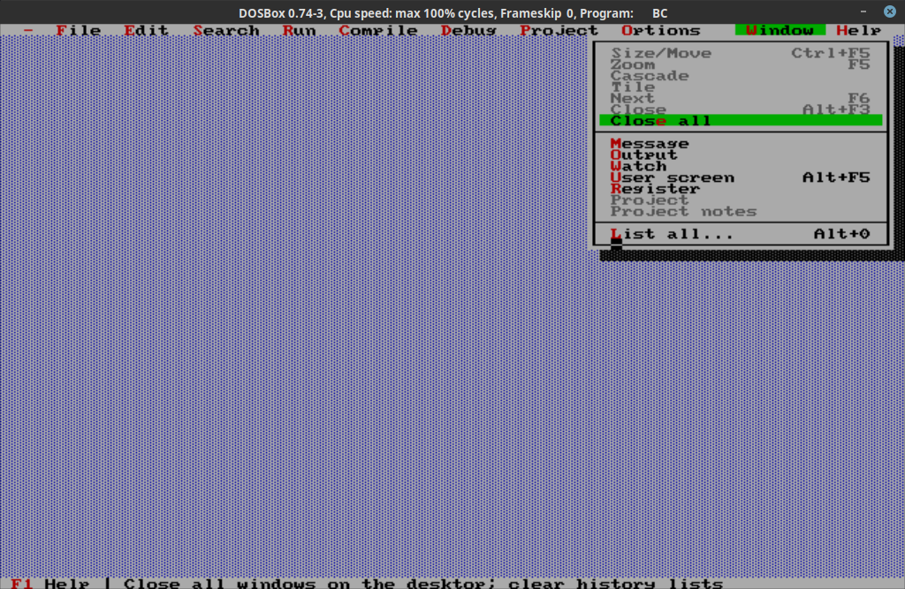
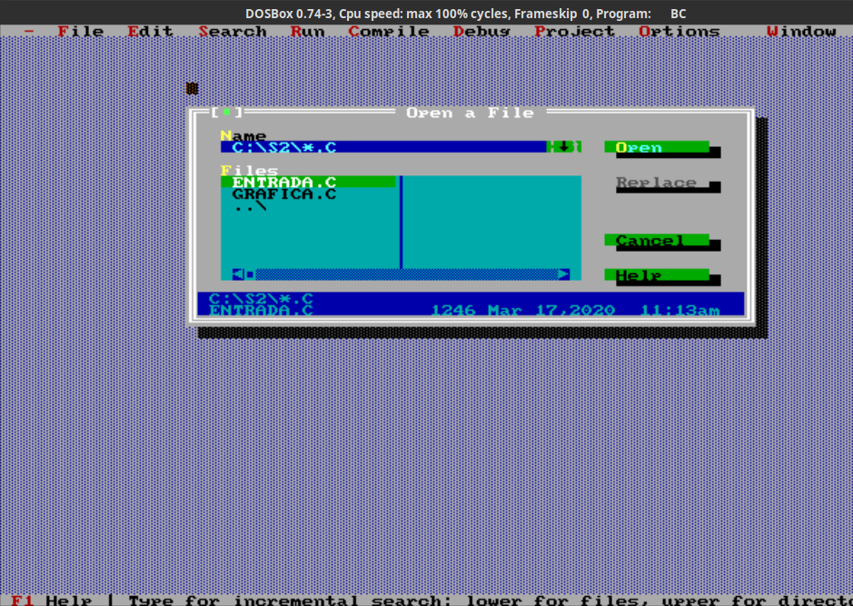
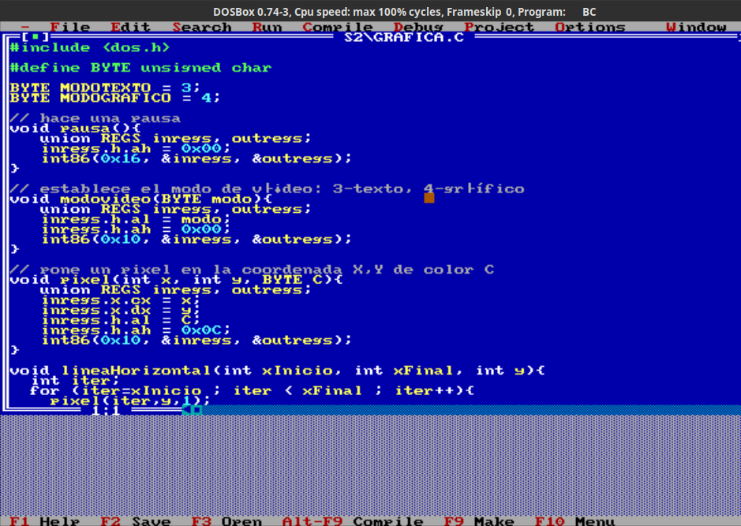
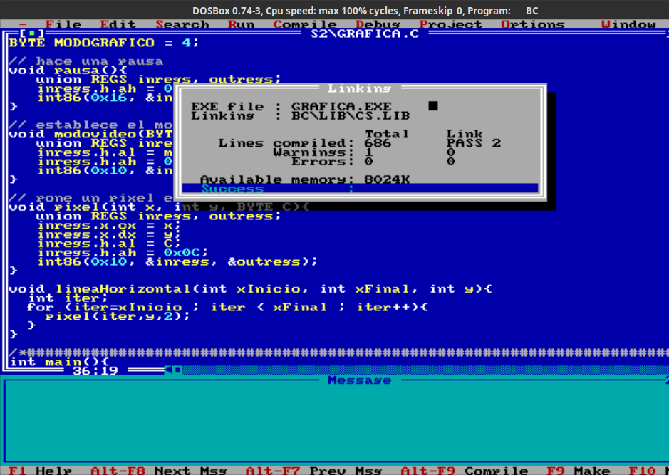
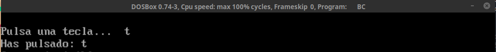
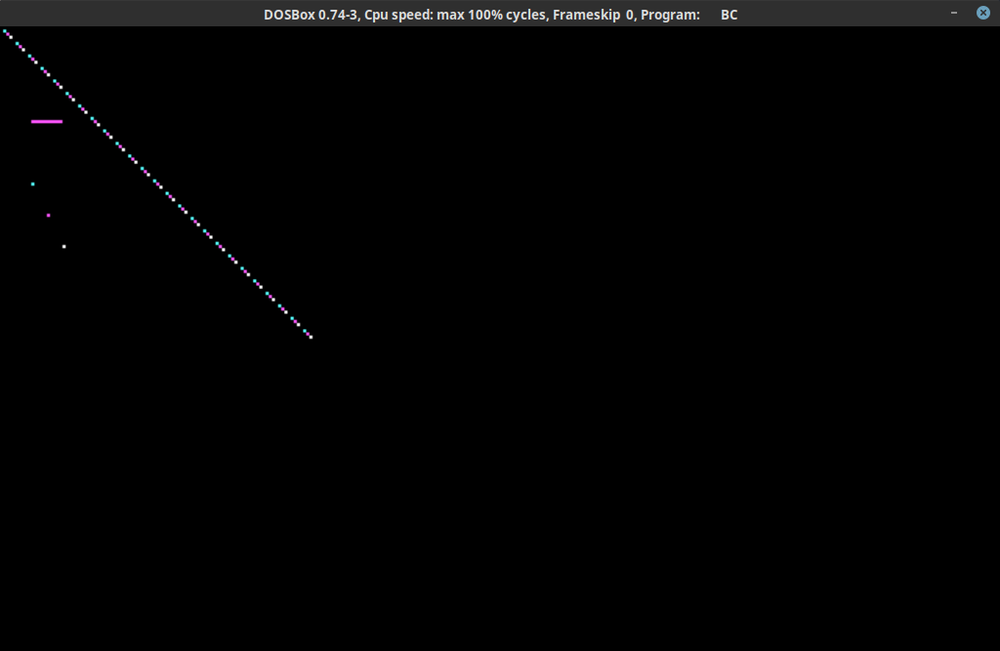

# Seminario 2. Acceso a dispositivos de E/S en C

# Tabla de contenidos
- [Seminario 2. Acceso a dispositivos de E/S en C](#seminario-2-acceso-a-dispositivos-de-es-en-c)
- [Tabla de contenidos](#tabla-de-contenidos)
  - [2.1 Instalando Borland C](#21-instalando-borland-c)
  - [2.2 Probando el IDE](#22-probando-el-ide)
  - [2.3 Probando los ejemplos](#23-probando-los-ejemplos)
    - [Teclado. Entrada y salida : `Entrada.c`](#teclado-entrada-y-salida--entradac)
    - [Gráficos : `Grafica.c`](#gráficos--graficac)

## 2.1 Instalando Borland C
Como ya se vio en el [Seminario anterior](../S1/README.md#12-preparando-el-compilador), podemos ver qué es `Borland C` y cómo añadir los binarios en el `PATH`.

## 2.2 Probando el IDE
Para iniciar el IDE, una vez añadido en el `PATH`, sólo hay que ejecutar el comando `BC`, dando como resultado esta ventana:


Para poder manejar el menú de arriba pulsamos `F10` o usamos el ratón, para llegar a `File>Open`:



Una vez abierto un archivo, se vería así, desde donde luego podemos compilar



Para compilar, podemos usar `Alt + F9` o `F9`. Primero avisa de advertencias, pero se puede proseguir. Si no hay errores veremos por pantalla algo como esto:



## 2.3 Probando los ejemplos
### Teclado. Entrada y salida : `Entrada.c`
```c
/*Getchar: usando la interrupción 21h, con AH = 1,
hace echo del carácter. Devuelve el caracter en AL.
Véase http://www.ctyme.com/intr/rb-2552.htm */
int mi_getchar(){
	 union REGS inregs, outregs;
	 int caracter;

	 inregs.h.ah = 1;
	 int86(0x21, &inregs, &outregs);

	 caracter = outregs.h.al;
	 return caracter;
}

/*Putchar: usando la interrupción 21h, con AH = 2 y el
caracter a escribir en DL, escribe el caracter en la salida estándar.
Véase http://www.ctyme.com/intr/rb-2554.htm */
void mi_putchar(char c){
	 union REGS inregs, outregs;

	 inregs.h.ah = 2;
	 inregs.h.dl = c;
	 int86(0x21, &inregs, &outregs);
}

int main(){
	printf("\nPulsa una tecla...  ");
	tmp = mi_getchar();

	printf("\nHas pulsado: ");
    mi_putchar( (char)tmp );
}
```

El resultado sería:


### Gráficos : `Grafica.c`

```c
#define BYTE unsigned char

BYTE MODOTEXTO = 3;
BYTE MODOGRAFICO = 4;

// Hace una pausa.
//Usa la interrupción 16h, encargada de controlar el 
//teclado del PC. AH=0 indica "Leer pulsación de tecla"
/*Source: https://es.wikipedia.org/wiki/Int_16h */
void pausa(){
   union REGS inregs, outregs;
   inregs.h.ah = 0x00;
   int86(0x16, &inregs, &outregs);
}

// establece el modo de vídeo: AL=3-texto(80x25), AL=4-gráfico(320x200)
//Usa la interrupción 10h, encargada de controlar los servicios de pantalla del PC. AH=0 indica activar cierto modo de vídeo.

/*Source : https://es.wikipedia.org/wiki/Int_10h */

void modovideo(BYTE modo){
   union REGS inregs, outregs;
   inregs.h.al = modo;
   inregs.h.ah = 0x00;
   int86(0x10, &inregs, &outregs);
}

// pone un pixel en la coordenada X,Y de color C
//Usa la interrupción 10h, encargada de controlar los servicios de pantalla del PC. AH=0xC indica escribir un píxel.

/*Source : https://es.wikipedia.org/wiki/Int_10h */

void pixel(int x, int y, BYTE C){
   union REGS inregs, outregs;
   inregs.x.cx = x;
   inregs.x.dx = y;
   inregs.h.al = C;
   inregs.h.ah = 0x0C;
   int86(0x10, &inregs, &outregs);
}

int main(){
	 int i;

	 modovideo(MODOGRAFICO); //gráfico

	 pixel(10,40,0);
	 pixel(10,50,1);
	 pixel(15,60,2);
	 pixel(20,70,3);

	 for(i=0; i<100; i++){
			pixel(i,i, i%4 );
	 }

	 pausa();
	 modovideo(MODOTEXTO); //texto

	return 0;
}
```

El resultado, al compilar, sería:


> Continuaremos trabajando con esto en la [Práctica 1](../P1/README.md), donde se harán funciones usando estas interrupciones en C; y profundizaremos en el tema.